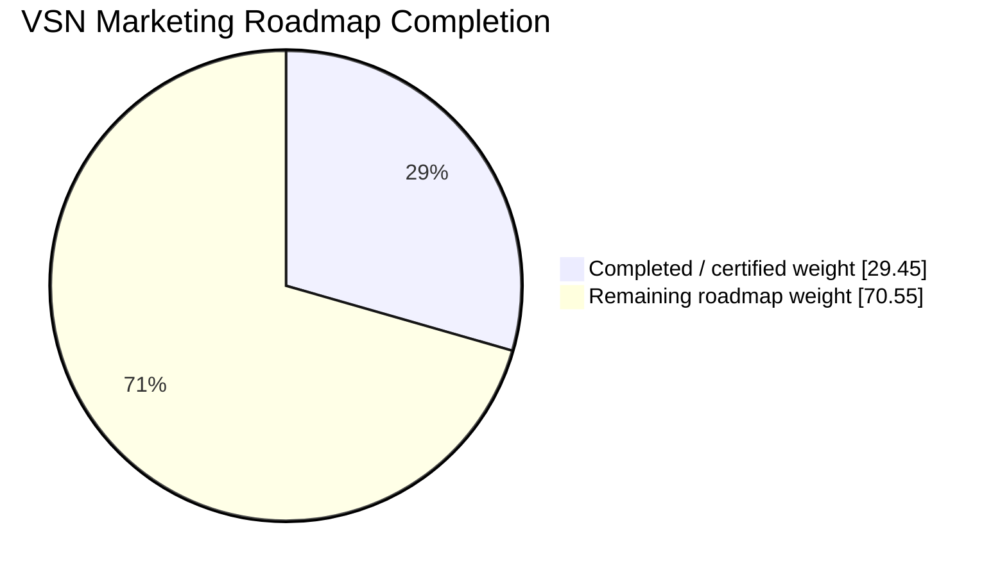

# VSN Marketing

AI-native, provider-agnostic marketing operating system under active development.

## Development progress

> Last verified: **2026-09-08** from trusted pre-cycle `main` baseline `4e2470b8f019faecde3bd0c64e089f1b5de5fdac` after README status PR #77.
>
> Canonical progress comes from [`.ai/state/CURRENT-STATE.yaml`](.ai/state/CURRENT-STATE.yaml) and [`.ai/roadmap/ROADMAP.yaml`](.ai/roadmap/ROADMAP.yaml). The README is a human-readable snapshot; canonical task acceptance remains in `.ai/`.

**Overall roadmap progress: 29.45%**  
**Current phase: PHASE-04 — 63.64%**  
**Active task: TASK-0021**  
**Last completed task: TASK-0020**  
**Parallel execution: 4 worker lanes + 1 Supervisor integration lane registered for the remaining TASK-0021 scope**

```text
Overall  [██████░░░░░░░░░░░░░░] 29.45%
Phase 04 [█████████████░░░░░░░] 63.64%
```



### Phase / module progress

| Phase | Weight | Main modules / capability | Status | Progress |
|---|---:|---|---|---:|
| PHASE-00 | 4% | Architecture, AI continuity, project governance | ✅ Complete | 100% |
| PHASE-01 | 7% | Core, Identity, Tenancy, RBAC, Audit, Security foundation, queues/runtime | ✅ Complete | 100% |
| PHASE-02 | 7% | Contacts, identities, companies, lists/tags, Consent, Events | ✅ Complete | 100% |
| PHASE-03 | 7% | Providers, Connectors, Webhooks, Integrations, provider security baseline | ✅ Complete | 100% |
| **PHASE-04** | **7%** | **Delivery, routing, throttling, idempotency, retry/failover, SLOs** | 🚧 **In progress** | **63.64%** |
| PHASE-05 | 6% | Domains, sender identity, Suppressions, Deliverability | ⏳ Planned | 0% |
| PHASE-06 | 6% | Templates, Content, Assets, creative/editor pipeline | ⏳ Planned | 0% |
| PHASE-07 | 7% | Campaigns, Publishing, approvals, scheduling, unified calendar | ⏳ Planned | 0% |
| PHASE-08 | 5% | Segments, deterministic query compiler, NL-to-segment compiler | ⏳ Planned | 0% |
| PHASE-09 | 7% | Journeys, automation runtime, triggers/waits/branches/replay | ⏳ Planned | 0% |
| PHASE-10 | 8% | AI gateway, memory/context, typed tools, agents, red-team | ⏳ Planned | 0% |
| PHASE-11 | 5% | Experiments, variants, statistical guardrails, adaptive optimization | ⏳ Planned | 0% |
| PHASE-12 | 6% | Analytics, funnels, cohorts, Attribution, revenue/LTV, data quality | ⏳ Planned | 0% |
| PHASE-13 | 5% | Omnichannel Connectors, social Publishing, Community, listening | ⏳ Planned | 0% |
| PHASE-14 | 5% | Connector Factory, generated adapter candidates, sandbox/security gates | ⏳ Planned | 0% |
| PHASE-15 | 4% | Bounded autonomous marketing loops, budgets, kill switch, canaries | ⏳ Planned | 0% |
| PHASE-16 | 4% | Enterprise identity/governance, Billing, white-label, residency, DR | ⏳ Planned | 0% |

### Current execution snapshot

PHASE-04 is active. `TASK-0019` delivery-engine research and `TASK-0020` immutable execution snapshots are complete. `TASK-0021` remains active and is intentionally bounded to provider-neutral queue routing, durable logical-operation idempotency, quota/rate admission, backpressure and fairness over immutable TASK-0020 snapshots.

PR #75 (`TASK-0021: durable delivery operation admission foundation`) is merged. The integrated slice adds durable delivery operations, provider-neutral queue routes and priorities, stable workspace-scoped idempotency, deterministic provider-connection selection, canonical quota-evidence consumption, provider-specific canonical operation-cost accounting, tenant-safe persistence boundaries, idempotent quota admission/backpressure transitions, audit evidence and focused feature coverage.

The remaining TASK-0021 work is now decomposed into four conflict-safe worker lanes: deterministic workspace fairness policy, Redis-backed atomic admission coordination, PostgreSQL/Redis concurrency certification, and machine-readable backpressure observability. A fifth Supervisor lane owns shared admission wiring, canonical state/parallel registries, migrations and final integration. All five branches were pre-created from the same trusted main baseline before cycle planning/code mutation.

`TASK-0021` is **not complete yet**. Required remaining evidence is Redis-backed runtime concurrency/fairness, saturation behavior, machine-readable backpressure age/reason, and production-representative PostgreSQL/Redis concurrent-admission proof. Retry classification, circuit breakers, dead letters, reconciliation, remote-execution failover, sender-domain/deliverability policy, credentials, paid sends and TASK-0022+ behavior remain out of scope for the current task.

Current canonical calculation:

```text
PHASE-00  4.00 / 4.00
PHASE-01  7.00 / 7.00
PHASE-02  7.00 / 7.00
PHASE-03  7.00 / 7.00
PHASE-04  4.45 / 7.00
---------------------
TOTAL    29.45 / 100
```

## Delivery estimate assumptions

Delivery timing depends on exact-head CI, production-representative concurrency evidence, provider policies, security gates, accessibility, AI evaluation/red-team work, and enterprise recovery/compliance requirements. The roadmap is research-first, so estimates should be recalculated after each phase certification rather than treated as fixed deadlines.

## For coding agents and contributors

Agent instruction revision: `parallel-v2.1-supervisor-onboarding`  
Agent instruction fingerprint: `d2f26c4a767db4bfda4e89b38eac2ea1958c160a26327a1715d88ed7452cdc75`

VSN uses a **Supervisor-controlled multi-agent workflow**. The agent operating the main-repository context is the Supervisor; protected `main` is not a scratch branch. Worker and Supervisor implementation happens on pre-created dedicated branches/worktrees listed in [`.ai/parallel/AI-NATIVE-PLAN.md`](.ai/parallel/AI-NATIVE-PLAN.md).

Before modifying the repository, read this README, [`AGENTS.md`](AGENTS.md), [`.ai/13-PARALLEL-DEVELOPMENT.md`](.ai/13-PARALLEL-DEVELOPMENT.md), and the machine registries under [`.ai/parallel/`](.ai/parallel/). Then run the full startup sequence from `AGENTS.md`, including:

```bash
python tools/ai_txn.py recover
python tools/ai_txn.py validate
python tools/ai_state.py recover
python tools/ai_state.py validate
python tools/ai_journal.py validate
python tools/ai_policy.py
python tools/ai_parallel.py validate
python tools/ai_context.py manifest
python tools/ai_state.py status
python tools/ai_journal.py status
python tools/ai_parallel.py status
python tools/ai_parallel.py sync-check
```

### Parallel agent rules

- **Branch-first:** for a declared parallel cycle, the Supervisor's first repository mutation is creating every worker branch and its own `supervisor/...` branch. No planning/code write precedes branch creation.
- **One writer, one lane:** writable parallel work requires a registered workstream, assigned logical agent, dedicated branch/worktree, exclusive lease, dependency readiness, and non-overlapping write paths.
- **Shared files:** workers do not edit Supervisor-owned state/tasks/roadmap/parallel registries, dependency manifests, workflows/config/routes, migrations, Core, or canonical connector contracts.
- **Completion:** when a worker or the Supervisor finishes its assigned workstream, its non-draft PR must contain `Workstream: <ID>` and the exact standalone signal **`Work Done and Submitted`**.
- **Supervisor interrupt:** a submitted workstream PR preempts optional Supervisor module work. The Supervisor pauses, reviews, merges only approved/current-main/green changes, synchronizes its own branch, then resumes.
- **Merge alert:** after every workstream merge the Supervisor posts this exact alert to GitHub issue [#43](https://github.com/Vertex-Systems-Network/vsn-marketing/issues/43) and every other open registered workstream PR: **`New changes have been merged — please merge these changes into your branch first, then resume your own work.`**
- **Resume only after sync:** every alerted agent must merge/pull latest `main`, pass `python tools/ai_parallel.py sync-check`, rerun affected fast checks, and only then resume.

The active TASK-0021 parallel cycle currently has four leased worker lanes and one Supervisor integration lane. Worker ownership is disjoint and machine-registered in `.ai/parallel/WORKSTREAMS.yaml` / `.ai/parallel/AGENT-LEASES.yaml`; shared state, migrations, README, database-admission wiring and service-provider integration remain Supervisor-only.

**Instruction sync is mandatory:** whenever canonical agent-working instructions change, the same PR must review/update this section, bump the instruction revision when behavior changes materially, recompute `.ai/parallel/CONTROL.yaml`'s deterministic fingerprint, and copy the same revision/fingerprint here. `python tools/ai_parallel.py validate` and CI fail closed on drift.

### New agent onboarding

Every new development agent begins from `main` and runs:

```bash
python tools/ai_parallel.py onboarding-check --branch main
```

The Supervisor checks the AI-Native Plan for an open slot and assigns one deterministically with:

```bash
python tools/ai_parallel.py onboard --agent <agent-name> --agent-start-branch main
```

The assignment marks the slot occupied, records the agent and start status, and refreshes the AI-Native Plan. If all worker/research/QA slots are occupied, onboarding stops immediately and the Supervisor must reply exactly: **`Go Home Come Back Next Time`**. The rejected agent receives no branch assignment, lease, or work.

Dynamic agent/slot assignments update orchestration state but do not require a README fingerprint bump unless working instructions themselves change.

The active task, exact next action, progress, blockers, tests, roadmap, architecture rules, last checkpoint, workstreams, leases, and merge protocol live under [`.ai/`](.ai/).

## Architectural direction

- Modular monolith first; event-driven boundaries.
- Provider-neutral core with SMTP/API/mailbox/marketing adapters.
- Canonical customer, consent, event, message, template, campaign and journey models.
- Deterministic consent/suppression/security/approval gates.
- Specialized AI agents behind typed tools and structured outputs.
- Future AI Connector Factory for controlled provider integration generation.

Implementation sequence is defined in [`.ai/roadmap/MASTER-ROADMAP.md`](.ai/roadmap/MASTER-ROADMAP.md).
