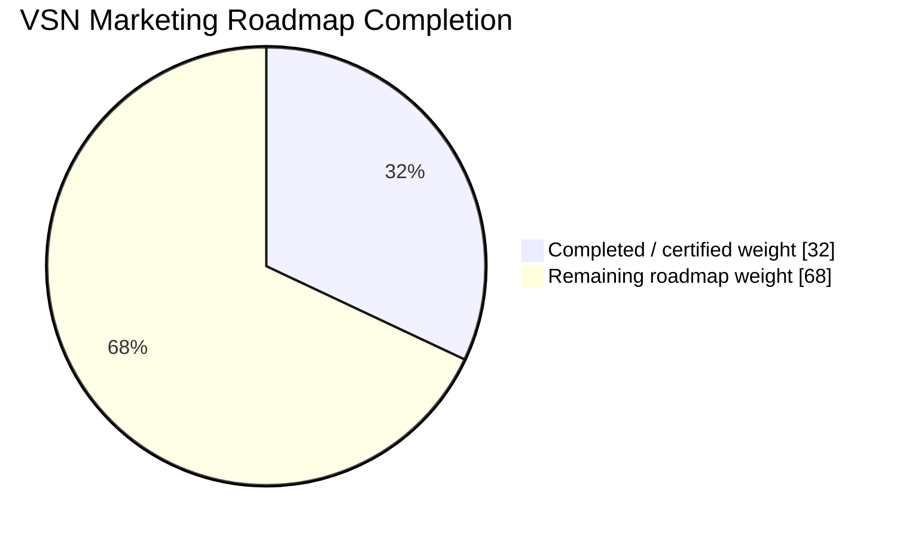

# VSN Marketing

AI-native, provider-agnostic marketing operating system under active development.

## Development progress

> Last verified: **2026-09-10** from trusted `main` at `94461fe3d050a04bd87b86820232577caf9ad8e3` after TASK-0022 recovery/reconciliation/failover completion merged and post-merge AI Continuity, Application Foundation, Security Supply Chain, Release Integrity, and OpenSSF Scorecard workflows passed.
>
> Canonical progress comes from [`.ai/state/CURRENT-STATE.yaml`](.ai/state/CURRENT-STATE.yaml) and [`.ai/roadmap/ROADMAP.yaml`](.ai/roadmap/ROADMAP.yaml). The README is a human-readable snapshot; canonical task acceptance remains in `.ai/`.

**Overall roadmap progress: 32.00%**  
**Current phase: PHASE-04 — 100.00% of currently machine-registered weighted work**  
**Active task: TASK-0101 — Persistent GitHub-native Supervisor control plane**  
**Last completed task: TASK-0022**  
**Parallel execution: one Supervisor-owned TASK-0101 lane on `supervisor/task-0101-persistent-control-plane`; no worker lane is required for this cross-cutting governance task**

```text
Overall  [██████░░░░░░░░░░░░░░] 32.00%
Phase 04 [████████████████████] 100.00% registered weighted work
```



### Phase / module progress

| Phase | Weight | Main modules / capability | Status | Progress |
|---|---:|---|---|---:|
| PHASE-00 | 4% | Architecture, AI continuity, project governance | ✅ Complete | 100% |
| PHASE-01 | 7% | Core, Identity, Tenancy, RBAC, Audit, Security foundation, queues/runtime | ✅ Complete | 100% |
| PHASE-02 | 7% | Contacts, identities, companies, lists/tags, Consent, Events | ✅ Complete | 100% |
| PHASE-03 | 7% | Providers, Connectors, Webhooks, Integrations, provider security baseline | ✅ Complete | 100% |
| **PHASE-04** | **7%** | **Delivery, routing, throttling, idempotency, retry/failover, SLOs** | 🚧 **Product sequence continues after TASK-0101** | **100% of registered weighted work** |
| PHASE-05 | 6% | Domains, sender identity, Suppressions, Deliverability | ⏳ Planned | 0% |
| PHASE-06 | 6% | Templates, Content, Assets, creative/editor pipeline | ⏳ Planned | 0% |
| PHASE-07 | 7% | Campaigns, Publishing, approvals, scheduling, unified calendar | ⏳ Planned | 0% |
| PHASE-08 | 5% | Segments, deterministic query compiler, NL-to-segment compiler | ⏳ Planned | 0% |
| PHASE-09 | 7% | Journeys, automation runtime, triggers/waits/branches/replay | ⏳ Planned | 0% |
| PHASE-10 | 8% | AI gateway, memory/context, typed tools, agents, red-team | ⏳ Planned | 0% |
| PHASE-11 | 5% | Experiments, variants, statistical guardrails, adaptive optimization | ⏳ Planned | 0% |
| PHASE-12 | 6% | Analytics, funnels, cohorts, Attribution, revenue/LTV, data quality | ⏳ Planned | 0% |
| PHASE-13 | 5% | Omnichannel Connectors, social Publishing, Community, listening | ⏳ Planned | 0% |
| PHASE-14 | 5% | Connector Factory, generated adapter candidates, sandbox/security gates | ⏳ Planned | 0% |
| PHASE-15 | 4% | Bounded autonomous marketing loops, budgets, kill switch, canaries | ⏳ Planned | 0% |
| PHASE-16 | 4% | Enterprise identity/governance, Billing, white-label, residency, DR | ⏳ Planned | 0% |

### Current execution snapshot

TASK-0022 is complete. The operator explicitly prioritized a repository-native persistent Supervisor before resuming the preplanned product sequence, so the additional cross-cutting governance work is registered as **TASK-0101** rather than stealing or renumbering an existing roadmap task.

The preplanned **TASK-0023 remains unchanged**: establish delivery SLO, load, saturation, fault-injection, and PostgreSQL/Redis production-parity gates. TASK-0024 remains PHASE-04 certification. TASK-0101 has zero roadmap weight, so inserting this governance prerequisite does not inflate product-progress calculations.

TASK-0101 installs `.github/workflows/persistent-supervisor.yml` as the GitHub-native always-on coordination runtime. Its design combines event-driven reconciliation with a five-minute scheduled heartbeat, uses one durable Supervisor status issue, recognizes only the exact standalone `Work Done and Submitted` signal, verifies current-main ancestry and exact-head required CI, and may emit a deduplicated `SUPERVISOR REVIEW READY` triage marker.

The authority boundary is strict: the persistent Supervisor does **not** auto-merge, auto-approve, move refs, force-push, change branch protection, weaken checks, edit canonical `.ai` state, or mutate product/runtime code. Pull-request content is treated as untrusted data. Privileged PR triage uses `pull_request_target` only with trusted default-branch code; PR head code is never checked out or executed with the write-capable coordination token.

The dedicated Supervisor lane was created from trusted main `94461fe3d050a04bd87b86820232577caf9ad8e3` before TASK-0101 planning/implementation writes:

- `WS-0101-PERSISTENT-SUPERVISOR` — deterministic GitHub API reconciliation, durable status issue, exact-head CI/ancestry readiness policy, and workflow wrapper.

Trusted-main certification before TASK-0101 activation:

- AI Continuity Guard `34507925149` — PASS
- Application Foundation CI `34507924783` — PASS
- Security Supply Chain CI `34507924951` — PASS
- Release Integrity `34507924894` — PASS
- OpenSSF Scorecard `34507924921` — PASS

Current canonical calculation:

```text
PHASE-00  4.00 / 4.00
PHASE-01  7.00 / 7.00
PHASE-02  7.00 / 7.00
PHASE-03  7.00 / 7.00
PHASE-04  7.00 / 7.00 registered weighted work
---------------------
TOTAL    32.00 / 100
```

The 100% PHASE-04 figure above is a deterministic calculation over currently machine-registered weighted tasks, not a claim that preplanned TASK-0023/TASK-0024 have been completed. They must be explicitly machine-registered and executed after TASK-0101.

## Delivery estimate assumptions

Delivery timing depends on exact-head CI, production-representative recovery/reconciliation evidence, provider policies, security gates, accessibility, AI evaluation/red-team work, and enterprise recovery/compliance requirements. The roadmap is research-first, so estimates should be recalculated after each phase certification rather than treated as fixed deadlines.

## For coding agents and contributors

Agent instruction revision: `parallel-v2.1-supervisor-onboarding`  
Agent instruction fingerprint: `d2f26c4a767db4bfda4e89b38eac2ea1958c160a26327a1715d88ed7452cdc75`

VSN uses a **Supervisor-controlled multi-agent workflow**. The agent operating the main-repository context is the Supervisor; protected `main` is not a scratch branch. Worker and Supervisor implementation happens on pre-created dedicated branches/worktrees listed in [`.ai/parallel/AI-NATIVE-PLAN.md`](.ai/parallel/AI-NATIVE-PLAN.md).

Before modifying the repository, read this README, [`AGENTS.md`](AGENTS.md), [`.ai/13-PARALLEL-DEVELOPMENT.md`](.ai/13-PARALLEL-DEVELOPMENT.md), and the machine registries under [`.ai/parallel/`](.ai/parallel/). Then run the full startup sequence from `AGENTS.md`, including:

```bash
python tools/ai_txn.py recover
python tools/ai_txn.py validate
python tools/ai_state.py recover
python tools/ai_state.py validate
python tools/ai_journal.py validate
python tools/ai_policy.py
python tools/ai_parallel.py validate
python tools/ai_context.py manifest
python tools/ai_state.py status
python tools/ai_journal.py status
python tools/ai_parallel.py status
python tools/ai_parallel.py sync-check
```

### Parallel agent rules

- **Branch-first:** for a declared parallel cycle, the Supervisor's first repository mutation is creating every worker branch and its own `supervisor/...` branch. No planning/code write precedes branch creation.
- **One writer, one lane:** writable parallel work requires a registered workstream, assigned logical agent, dedicated branch/worktree, exclusive lease, dependency readiness, and non-overlapping write paths.
- **Shared files:** workers do not edit Supervisor-owned state/tasks/roadmap/parallel registries, dependency manifests, workflows/config/routes, migrations, Core, or canonical connector contracts.
- **Completion:** when a worker or the Supervisor finishes its assigned workstream, its non-draft PR must contain `Workstream: <ID>` and the exact standalone signal **`Work Done and Submitted`**.
- **Supervisor interrupt:** a submitted workstream PR preempts optional Supervisor module work. The Supervisor pauses, reviews, merges only approved/current-main/green changes, synchronizes its own branch, then resumes.
- **Merge alert:** after every workstream merge the Supervisor posts this exact alert to GitHub issue [#43](https://github.com/Vertex-Systems-Network/vsn-marketing/issues/43) and every other open registered workstream PR: **`New changes have been merged — please merge these changes into your branch first, then resume your own work.`**
- **Resume only after sync:** every alerted agent must merge/pull latest `main`, pass `python tools/ai_parallel.py sync-check`, rerun affected fast checks, and only then resume.

The active TASK-0101 cycle has one registered Supervisor lane. Its GitHub-native runtime is staged on the dedicated Supervisor branch and becomes truly persistent only after merge to the default branch. No external ChatGPT schedule is part of repository supervision.

**Instruction sync is mandatory:** whenever canonical agent-working instructions change, the same PR must review/update this section, bump the instruction revision when behavior changes materially, recompute `.ai/parallel/CONTROL.yaml`'s deterministic fingerprint, and copy the same revision/fingerprint here. `python tools/ai_parallel.py validate` and CI fail closed on drift.

### New agent onboarding

Every new development agent begins from `main` and runs:

```bash
python tools/ai_parallel.py onboarding-check --branch main
```

The Supervisor checks the AI-Native Plan for an open slot and assigns one deterministically with:

```bash
python tools/ai_parallel.py onboard --agent <agent-name> --agent-start-branch main
```

The assignment marks the slot occupied, records the agent and start status, and refreshes the AI-Native Plan. If all worker/research/QA slots are occupied, onboarding stops immediately and the Supervisor must reply exactly: **`Go Home Come Back Next Time`**. The rejected agent receives no branch assignment, lease, or work.

Dynamic agent/slot assignments update orchestration state but do not require a README fingerprint bump unless working instructions themselves change.

The active task, exact next action, progress, blockers, tests, roadmap, architecture rules, last checkpoint, workstreams, leases, and merge protocol live under [`.ai/`](.ai/).

## Architectural direction

- Modular monolith first; event-driven boundaries.
- Provider-neutral core with SMTP/API/mailbox/marketing adapters.
- Canonical customer, consent, event, message, template, campaign and journey models.
- Deterministic consent/suppression/security/approval gates.
- Specialized AI agents behind typed tools and structured outputs.
- Future AI Connector Factory for controlled provider integration generation.

Implementation sequence is defined in [`.ai/roadmap/MASTER-ROADMAP.md`](.ai/roadmap/MASTER-ROADMAP.md).
