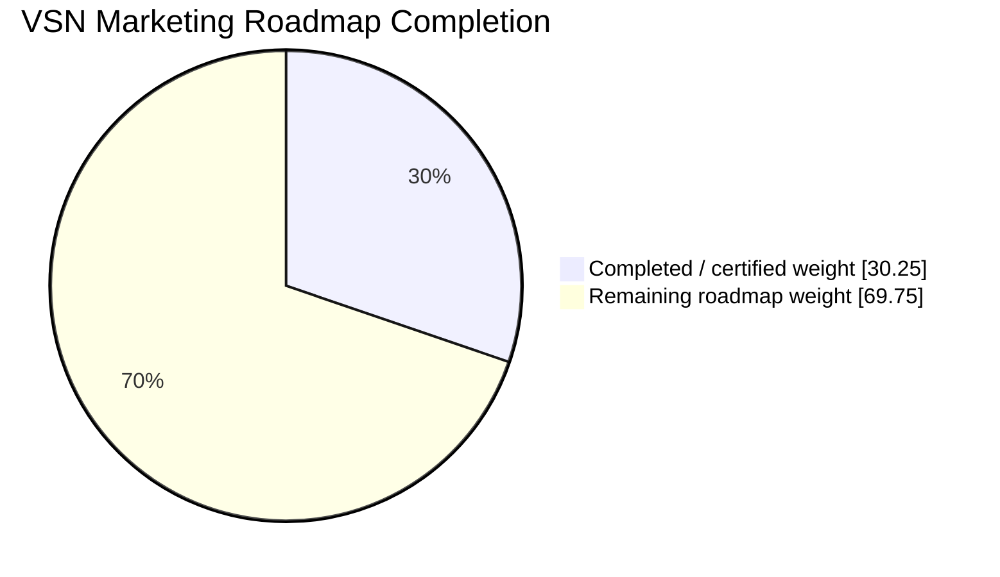

# VSN Marketing

AI-native, provider-agnostic marketing operating system under active development.

## Development progress

> Last verified: **2026-09-10** from trusted `main` at `c6dab8eff0e8284a1e39d3105429ba5931fec9da` after TASK-0101 Persistent Supervisor merged. Post-merge AI Continuity, Application Foundation, Security Supply Chain, Release Integrity, and OpenSSF Scorecard passed; Persistent Supervisor default-branch run `34523049920` passed and status issue #102 reached `HEALTHY`.
>
> Canonical progress comes from [`.ai/state/CURRENT-STATE.yaml`](.ai/state/CURRENT-STATE.yaml) and [`.ai/roadmap/ROADMAP.yaml`](.ai/roadmap/ROADMAP.yaml). The README is a human-readable snapshot; canonical task acceptance remains in `.ai/`.

**Overall roadmap progress: 30.25%**  
**Current phase: PHASE-04 — 75.00%**  
**Active task: TASK-0023 — Delivery SLO/load/saturation/fault-injection and PostgreSQL/Redis production-parity gates**  
**Last completed task: TASK-0101 — Persistent GitHub-native Supervisor control plane**  
**Next task: TASK-0024 — PHASE-04 certification**  
**Parallel execution: TASK-0023 activation is Supervisor-owned on `supervisor/task-0023-delivery-slo`; one QA capacity branch is pre-created but remains OPEN, unassigned and unleased**

```text
Overall  [██████░░░░░░░░░░░░░░] 30.25%
Phase 04 [███████████████░░░░░] 75.00%
```



### Phase / module progress

| Phase | Weight | Main modules / capability | Status | Progress |
|---|---:|---|---|---:|
| PHASE-00 | 4% | Architecture, AI continuity, project governance | ✅ Complete | 100% |
| PHASE-01 | 7% | Core, Identity, Tenancy, RBAC, Audit, Security foundation, queues/runtime | ✅ Complete | 100% |
| PHASE-02 | 7% | Contacts, identities, companies, lists/tags, Consent, Events | ✅ Complete | 100% |
| PHASE-03 | 7% | Providers, Connectors, Webhooks, Integrations, provider security baseline | ✅ Complete | 100% |
| **PHASE-04** | **7%** | **Delivery, routing, throttling, idempotency, retry/failover, SLOs** | 🚧 **In progress — TASK-0023** | **75.00%** |
| PHASE-05 | 6% | Domains, sender identity, Suppressions, Deliverability | ⏳ Planned | 0% |
| PHASE-06 | 6% | Templates, Content, Assets, creative/editor pipeline | ⏳ Planned | 0% |
| PHASE-07 | 7% | Campaigns, Publishing, approvals, scheduling, unified calendar | ⏳ Planned | 0% |
| PHASE-08 | 5% | Segments, deterministic query compiler, NL-to-segment compiler | ⏳ Planned | 0% |
| PHASE-09 | 7% | Journeys, automation runtime, triggers/waits/branches/replay | ⏳ Planned | 0% |
| PHASE-10 | 8% | AI gateway, memory/context, typed tools, agents, red-team | ⏳ Planned | 0% |
| PHASE-11 | 5% | Experiments, variants, statistical guardrails, adaptive optimization | ⏳ Planned | 0% |
| PHASE-12 | 6% | Analytics, funnels, cohorts, Attribution, revenue/LTV, data quality | ⏳ Planned | 0% |
| PHASE-13 | 5% | Omnichannel Connectors, social Publishing, Community, listening | ⏳ Planned | 0% |
| PHASE-14 | 5% | Connector Factory, generated adapter candidates, sandbox/security gates | ⏳ Planned | 0% |
| PHASE-15 | 4% | Bounded autonomous marketing loops, budgets, kill switch, canaries | ⏳ Planned | 0% |
| PHASE-16 | 4% | Enterprise identity/governance, Billing, white-label, residency, DR | ⏳ Planned | 0% |

### Current execution snapshot

TASK-0101 is complete. The repository-native Persistent Supervisor is now standing infrastructure on `main`; no external ChatGPT schedule is part of repository supervision. Its GitHub Actions workflow combines event-driven reconciliation with a five-minute heartbeat, maintains the durable `[Supervisor] Persistent Control Plane Status` issue, verifies current-main ancestry and exact-head required CI for registered submissions, and does not auto-merge or mutate canonical/product state.

Product execution has returned to the preserved PHASE-04 roadmap. TASK-0023 and TASK-0024 use the preplanned specifications originally reserved before TASK-0101 was inserted. TASK-0023 carries the remaining delivery SLO/load/fault-injection work and TASK-0024 is the final PHASE-04 certification task.

TASK-0023 requires measured production-representative evidence rather than scale claims by assumption. Its scope includes queue-age/throughput/saturation/reconciliation-lag and meaningful p95/p99 SLIs/SLOs, PostgreSQL/Redis normal/burst/quota/saturation workloads, worker/Redis/PostgreSQL/provider fault injection, duplicate and retry-amplification evidence, recovery behavior, hotspot telemetry, and automated deterministic regression thresholds where stable.

The current activation control-plane workstream is `WS-0023-ACTIVATION`. Its standalone completion signal refers only to TASK-0023 registration/activation and parallel handoff; it does **not** claim TASK-0023 performance acceptance is complete. After activation reaches `main`, fresh implementation lanes must synchronize from that main before performance/load/fault work begins.

Current canonical PHASE-04 calculation:

```text
TASK-0019  15 / 15  completed
TASK-0020  20 / 20  completed
TASK-0021  20 / 20  completed
TASK-0022  20 / 20  completed
TASK-0023   0 / 15  ready
TASK-0024   0 / 10  planned
TASK-0101   0 /  0  completed governance insertion
-----------------------------------------------
PHASE-04   75 / 100 = 75.00%
ROADMAP                30.25%
```

Trusted-main evidence before TASK-0023 activation:

- AI Continuity Guard `34522847507` — PASS
- Application Foundation CI `34522847451` — PASS
- Security Supply Chain CI `34522847473` — PASS
- Release Integrity `34522847562` — PASS
- OpenSSF Scorecard `34522847785` — PASS
- Persistent Supervisor `34523049920` — PASS
- Persistent status issue #102 — `HEALTHY`, no blockers

## Delivery estimate assumptions

Delivery timing depends on exact-head CI, production-representative recovery/reconciliation evidence, provider policies, security gates, accessibility, AI evaluation/red-team work, and enterprise recovery/compliance requirements. The roadmap is research-first, so estimates should be recalculated after each phase certification rather than treated as fixed deadlines.

## For coding agents and contributors

Agent instruction revision: `parallel-v2.1-supervisor-onboarding`  
Agent instruction fingerprint: `d2f26c4a767db4bfda4e89b38eac2ea1958c160a26327a1715d88ed7452cdc75`

VSN uses a **Supervisor-controlled multi-agent workflow**. The agent operating the main-repository context is the Supervisor; protected `main` is not a scratch branch. Worker and Supervisor implementation happens on pre-created dedicated branches/worktrees listed in [`.ai/parallel/AI-NATIVE-PLAN.md`](.ai/parallel/AI-NATIVE-PLAN.md).

Before modifying the repository, read this README, [`AGENTS.md`](AGENTS.md), [`.ai/13-PARALLEL-DEVELOPMENT.md`](.ai/13-PARALLEL-DEVELOPMENT.md), and the machine registries under [`.ai/parallel/`](.ai/parallel/). Then run the full startup sequence from `AGENTS.md`, including:

```bash
python tools/ai_txn.py recover
python tools/ai_txn.py validate
python tools/ai_state.py recover
python tools/ai_state.py validate
python tools/ai_journal.py validate
python tools/ai_policy.py
python tools/ai_parallel.py validate
python tools/ai_context.py manifest
python tools/ai_state.py status
python tools/ai_journal.py status
python tools/ai_parallel.py status
python tools/ai_parallel.py sync-check
```

### Parallel agent rules

- **Branch-first:** for a declared parallel cycle, the Supervisor's first repository mutation is creating every worker branch and its own `supervisor/...` branch. No planning/code write precedes branch creation.
- **One writer, one lane:** writable parallel work requires a registered workstream, assigned logical agent, dedicated branch/worktree, exclusive lease, dependency readiness, and non-overlapping write paths.
- **Shared files:** workers do not edit Supervisor-owned state/tasks/roadmap/parallel registries, dependency manifests, workflows/config/routes, migrations, Core, or canonical connector contracts.
- **Completion:** when a worker or the Supervisor finishes its assigned workstream, its non-draft PR must contain `Workstream: <ID>` and the exact standalone signal **`Work Done and Submitted`**.
- **Supervisor interrupt:** a submitted workstream PR preempts optional Supervisor module work. The Supervisor pauses, reviews, merges only approved/current-main/green changes, synchronizes its own branch, then resumes.
- **Merge alert:** after every workstream merge the Supervisor posts this exact alert to GitHub issue [#43](https://github.com/Vertex-Systems-Network/vsn-marketing/issues/43) and every other open registered workstream PR: **`New changes have been merged — please merge these changes into your branch first, then resume your own work.`**
- **Resume only after sync:** every alerted agent must merge/pull latest `main`, pass `python tools/ai_parallel.py sync-check`, rerun affected fast checks, and only then resume.

The active control-plane slice has one occupied Supervisor activation lane and one OPEN QA capacity slot. Only `supervisor-main` is currently assigned/leased. The QA branch must merge the activation main and pass sync-check before it can be leased for TASK-0023 implementation evidence.

The Persistent Supervisor is independent standing infrastructure: `.github/workflows/persistent-supervisor.yml` continues to observe repository state between interactive sessions, but its review-ready marker is triage only and never approval or merge authority.

**Instruction sync is mandatory:** whenever canonical agent-working instructions change, the same PR must review/update this section, bump the instruction revision when behavior changes materially, recompute `.ai/parallel/CONTROL.yaml`'s deterministic fingerprint, and copy the same revision/fingerprint here. `python tools/ai_parallel.py validate` and CI fail closed on drift.

### New agent onboarding

Every new development agent begins from `main` and runs:

```bash
python tools/ai_parallel.py onboarding-check --branch main
```

The Supervisor checks the AI-Native Plan for an open slot and assigns one deterministically with:

```bash
python tools/ai_parallel.py onboard --agent <agent-name> --agent-start-branch main
```

The assignment marks the slot occupied, records the agent and start status, and refreshes the AI-Native Plan. If all worker/research/QA slots are occupied, onboarding stops immediately and the Supervisor must reply exactly: **`Go Home Come Back Next Time`**. The rejected agent receives no branch assignment, lease, or work.

Dynamic agent/slot assignments update orchestration state but do not require a README fingerprint bump unless working instructions themselves change.

The active task, exact next action, progress, blockers, tests, roadmap, architecture rules, last checkpoint, workstreams, leases, and merge protocol live under [`.ai/`](.ai/).

## Architectural direction

- Modular monolith first; event-driven boundaries.
- Provider-neutral core with SMTP/API/mailbox/marketing adapters.
- Canonical customer, consent, event, message, template, campaign and journey models.
- Deterministic consent/suppression/security/approval gates.
- Specialized AI agents behind typed tools and structured outputs.
- Future AI Connector Factory for controlled provider integration generation.

Implementation sequence is defined in [`.ai/roadmap/MASTER-ROADMAP.md`](.ai/roadmap/MASTER-ROADMAP.md).
